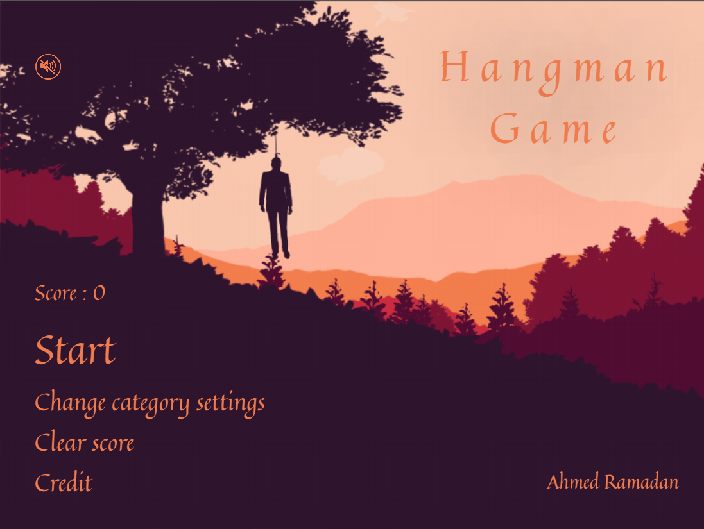

# Hangman Game - Vanilla JavaScript Implementation

A fully interactive Hangman game built using **pure JavaScript, HTML, and CSS**, without frameworks or external libraries.

This project focuses on **state management, DOM control, UI transitions, animations, and persistent user preferences**, demonstrating solid frontend fundamentals rather than reliance on abstractions.

## 

[](https://drive.google.com/file/d/1ji2oNS21rAFn0UYDrK7DukR_aMPBn-m7/view?usp=sharing)

## 🎯 Purpose

- Demonstrate strong understanding of vanilla JavaScript
- Build a non-trivial interactive UI without frameworks
- Manage application state across multiple screens
- Implement persistent user data without a backend
- Apply CSS animations to enhance user experience

---

## ✨ Features

### Game Logic

- Random word generation by category
- Progressive hangman rendering per failed attempt
- Win and game-over detection
- Score system with rewards and penalties
- Optional word reveal after losing

### Category System

- Multiple word categories:
    - Animals
    - Food
    - Clothes
    - Jobs
    - Sports
- User-selectable categories
- Validation to prevent starting without at least one category

### Persistent State (Cookies)

- Score persistence across sessions
- Category selection persistence
- Audio mute state persistence
- No backend or localStorage required

### User Interface

- Custom on-screen keyboard (A–Z)
- Disabled input handling after game completion
- Clear separation between menu, settings, gameplay, and results
- Animated transitions between application states

### Audio

- Background music with mute/unmute toggle
- Audio state synchronized with UI and saved in cookies

---

## 🧠 Technical Highlights

### JavaScript

- Zero dependencies
- Centralized game state variables
- Deterministic scoring and attempt tracking
- Utility functions for string and index manipulation
- Event delegation for keyboard interaction
- Cookie-based data serialization

### CSS

- Custom font integration
- Complex reveal animations using CSS masking
- Controlled transitions via class toggling
- Visual feedback for correct and incorrect guesses
- Responsive layout inside a fixed game container

### Architecture

```
index.html         - Application structure
style.css          - Layout, styling, and animations
index.js           - Game logic and state handling
utils/word_list.js - Category-based word source
resources/         - Fonts, images, audio assets
```

---

## ⚙️ Game Flow

1. Loading screen with animated progress bar
2. Main menu
3. Optional category configuration
4. Gameplay loop
5. Win or game-over state
6. Score update and reset

---

## 🧪 Edge Cases Handled

- Preventing invalid category selections
- Disabling keyboard input after win/loss
- Safe UI reset between games
- Correct handling of repeated letters
- Score integrity during resets

---

## 🚀 Running the Project

No build step required.

```bash
git clone https://github.com/ahmed-ramadan-professional/hangman-vanilla-javascript.git
cd hangman-vanilla-javascript
open index.html
```

> For best results, run using a local server to avoid asset loading issues.

---

## 👤 Author

**Ahmed Ramadan**

- GitHub: https://github.com/ahmed-ramadan-professional
- LinkedIn: https://www.linkedin.com/in/ahmed-ramadan-professional/
- Email: ahmedramadanproessional@gmail.com
